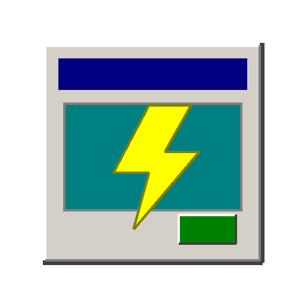

# ⚡ Alive Forever

<p align="center">
  
</p>

<p align="center">
  <strong>Keep your Microsoft Teams status "Active" - forever.</strong>
</p>

<p align="center">
  
  
  
</p>

---

## 🎯 What It Does

**Alive Forever** is a lightweight Windows application that prevents Microsoft Teams from automatically setting your status to "Away" due to inactivity. It runs quietly in your system tray and simulates subtle keyboard activity to keep you appearing "Active".

### ✨ Features

- 🟢 **Always Active** - Keeps Teams showing green "Available" status
- 🖥️ **System Tray App** - Runs silently in the background
- ⚙️ **Modern Settings UI** - Beautiful dark-themed configuration panel
- 🎯 **Multiple Activity Types** - F15 key (invisible) or mouse jiggle
- ⏱️ **Configurable Interval** - Set activity frequency (10-300 seconds)
- 🚀 **Windows Startup** - Optional auto-start with Windows
- 📊 **Live Stats** - Track uptime and activity count
- 💾 **Persistent Settings** - Your preferences are saved automatically

---

## 🚀 Quick Start

### Option 1: Double-Click Launch (Easiest)

1. **Download** or clone this repository
2. **Double-click** `run.bat`
3. Done! Look for the **cyan circle icon** in your system tray

### Option 2: Manual Python Launch

```bash
# Clone the repository
git clone https://github.com/abutsik4/Alive_Forever.git
cd Alive_Forever

# Install dependencies
pip install -r requirements.txt

# Run the app
python keep_alive.py
```

---

## 📖 How to Use

### System Tray Icon

After launching, the app runs in your **system tray** (bottom-right corner, near the clock).

| Icon | Meaning |
|:----:|---------|
| 🔵 ✓ | **Active** - Keeping you online |
| ⚫ ⏸ | **Paused** - Normal Teams behavior |

### Tray Menu Options

**Right-click** the tray icon to access:

- **⏸ Pause / ▶ Resume** - Toggle the keep-alive function
- **⚙ Settings** - Open the configuration panel
- **✕ Quit** - Exit the application

### Settings Panel

<p align="center">
  <em>Access via tray icon → ⚙ Settings</em>
</p>

| Setting | Description | Default |
|---------|-------------|---------|
| **Activity Interval** | Seconds between activity simulations | 60 |
| **Activity Type** | F15 Key (recommended), Mouse Jiggle, or Both | F15 Key |
| **Start with Windows** | Auto-launch when you log in | Off |
| **Start Minimized** | Go straight to tray on launch | On |

---

## ⚙️ How It Works

The app uses one of two methods to simulate user activity:

### 🔑 F15 Key Press (Recommended)
Simulates pressing the F15 key, which:
- ✅ Registers as keyboard activity to Windows
- ✅ Is completely invisible (no on-screen effect)
- ✅ Won't interfere with your work
- ✅ Works even with Teams minimized

### 🖱️ Mouse Jiggle
Moves the mouse cursor 1 pixel and back:
- ✅ Registers as mouse activity
- ⚠️ May be slightly noticeable if you're doing precise work

---

## 📁 Project Structure

```
Alive_Forever/
├── keep_alive.py      # Main application code
├── run.bat            # Windows launcher script
├── requirements.txt   # Python dependencies
├── config.json        # Settings (auto-generated)
├── icon.png           # Application icon
└── README.md          # This file
```

---

## 🔧 Requirements

- **Windows 10/11**
- **Python 3.8+** ([Download](https://www.python.org/downloads/))

### Dependencies

| Package | Purpose |
|---------|---------|
| `pystray` | System tray icon functionality |
| `pillow` | Icon image generation |

Dependencies are automatically installed on first run.

---

## 🏃 Run at Windows Startup

**Option A: Via Settings Panel**
1. Right-click tray icon → ⚙ Settings
2. Enable "Start with Windows"
3. Click "💾 Save Settings"

**Option B: Manual**
1. Press `Win + R`
2. Type `shell:startup` and press Enter
3. Create a shortcut to `run.bat` in this folder

---

## ❓ FAQ

**Q: Will this get me in trouble at work?**
> This is a personal productivity tool. Use responsibly and in accordance with your organization's policies.

**Q: Does it work when Teams is minimized?**
> Yes! The activity simulation works at the Windows level, regardless of Teams' window state.

**Q: Will it prevent my PC from sleeping?**
> No, it only simulates keyboard/mouse activity. Your PC's power management settings are unaffected.

**Q: How do I completely close it?**
> Right-click the tray icon → ✕ Quit, or close the console window if visible.

**Q: Can I change the activity interval?**
> Yes! Open Settings and adjust the "Activity Interval" slider (10-300 seconds).

---

## 🛠️ Troubleshooting

| Issue | Solution |
|-------|----------|
| **App doesn't start** | Ensure Python 3.8+ is installed and in PATH |
| **No tray icon visible** | Check the hidden icons area (^ arrow in taskbar) |
| **Settings won't open** | Try restarting the app |
| **Teams still shows Away** | Try "Both" activity type in settings |

---

## 📜 License

MIT License - feel free to use, modify, and distribute.

---

## 🙏 Contributing

Contributions welcome! Feel free to:
- 🐛 Report bugs
- 💡 Suggest features
- 🔧 Submit pull requests

---

<p align="center">
  Made with ⚡ to keep you <strong>Alive Forever</strong>
</p>
